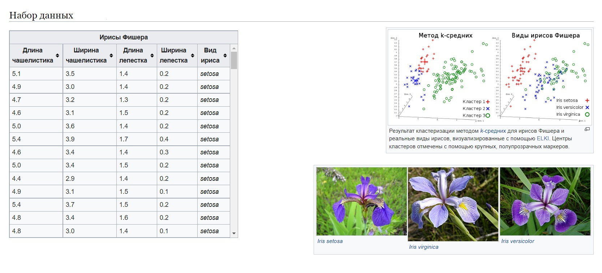

# 🧠 Модуль 1. Постановка задачи машинного обучения (Google Colab)

> 📌 Этот урок предназначен для первого знакомства с машинным обучением. Всё работает прямо в Google Colab — ничего устанавливать не нужно.

---

## 🔹 1. Три типа машинного обучения

### 📘 Обучение с учителем (Supervised Learning)

```markdown
• Есть данные (X) и правильные ответы (y)  
• Модель учится на парах "вход → ответ"

Примеры:
- Классификация: спам/не спам
- Регрессия: предсказание цен
```

### 📘 Обучение без учителя (Unsupervised Learning)

```markdown
• Только входные данные (X), без ответов  
• Модель выявляет скрытые паттерны

Примеры:
- Кластеризация клиентов
- Снижение размерности
```

### 📘 Обучение с подкреплением (Reinforcement Learning)

```markdown
• Агент взаимодействует с окружением
• Цель — максимизировать награду

Примеры:
- Роботы, игры, автопилоты
```

---

## 🔹 2. Схема построения системы ML

```markdown
1. Сбор данных
2. Очистка / подготовка
3. Построение модели
4. Обучение
5. Оценка
6. Применение
```

📌 Ниже начнём с примера на Python!

---

## 🔹 3. Подключение инструментов


## 🌸 Что такое "Ирисы Фишера"?



**Ирисы Фишера** (или **набор данных Iris**) — это **один из самых известных датасетов** в машинном обучении. Он используется для задач **классификации**, особенно когда ты только начинаешь изучать модели.

---

### 📦 Содержание набора

Каждая строка — это **цветок ириса**, описанный 4 признаками:

| Признак        | Что это            | Единица измерения |
| -------------- | ------------------ | ----------------- |
| `sepal length` | длина чашелистика  | см                |
| `sepal width`  | ширина чашелистика | см                |
| `petal length` | длина лепестка     | см                |
| `petal width`  | ширина лепестка    | см                |

И цель — **предсказать вид ириса** (то есть класс):

1. **Setosa**
2. **Versicolor**
3. **Virginica**

---

### 🔍 Зачем он нужен?

Это **классическая задача классификации** с 3 классами. Благодаря небольшому объёму (150 образцов) и числовым признакам — удобно тренировать и визуализировать модели.

---

### 📉 Как выглядит распределение?

* **Setosa** легко отделим от двух других видов.
* **Versicolor и Virginica** труднее разделить — границы «размыты».

---

## 🧭 Схема

Вот простая схема, поясняющая структуру данных и задачу:

```
            🌸 Набор данных IRIS
    ┌────────────────────────────────┐
    │     Характеристики цветка      │
    ├────────────────────────────────┤
    │ 1. Длина чашелистика (см)      │
    │ 2. Ширина чашелистика (см)     │
    │ 3. Длина лепестка (см)         │
    │ 4. Ширина лепестка (см)        │
    └────────────────────────────────┘
                 │
                 ▼
    ┌────────────────────────────────┐
    │       Модель классификации     │
    └────────────────────────────────┘
                 │
                 ▼
    ┌────────────────────────────────┐
    │      Предсказанный вид ириса   │
    ├────────────────────────────────┤
    │ • Setosa                       │
    │ • Versicolor                   │
    │ • Virginica                    │
    └────────────────────────────────┘
```

---

## 📌 Подключение в Python

Если хочешь использовать этот набор данных в `scikit-learn`, это делается так:

```python
from sklearn.datasets import load_iris

iris = load_iris()
X = iris.data        # Признаки
y = iris.target      # Метки классов
print(iris.feature_names)   # Названия признаков
print(iris.target_names)    # Названия классов
```

---


```python
# Импорт необходимых библиотек
import pandas as pd
import numpy as np
import matplotlib.pyplot as plt
import seaborn as sns
from sklearn.datasets import load_iris

# Настройка визуализаций
sns.set(style="whitegrid")
```

---

## 🔹 4. Работа с первым датасетом (Ирисы Фишера)

```python
# Загрузка классического датасета
data = load_iris()
df = pd.DataFrame(data.data, columns=data.feature_names)
df['target'] = data.target

# Первые строки таблицы
df.head()
```

---

## 🔹 5. Визуализация данных

```python
# Гистограмма признаков по видам цветов
sns.pairplot(df, hue='target', palette='Set2')
plt.suptitle("Ирисы Фишера: распределение признаков", y=1.02)
plt.show()
```

---

## ✅ Упражнение (мини-практика)

```python
# Сколько всего записей и классов?
print("Размер данных:", df.shape)
print("Уникальные классы:", df['target'].unique())

# Средние значения по каждому виду
df.groupby('target').mean()
```

---

## 🔹 6. Итоги

| Термин                | Пояснение                          |
| --------------------------- | ------------------------------------------- |
| Признаки (features) | Что мы знаем про объект  |
| Метка (target, label)  | Что хотим предсказать    |
| Классификация  | Предсказание категорий |
| Регрессия          | Предсказание чисел         |
| Кластеризация  | Группировка без меток    |

---

## 🏁 Что дальше?

Перейдём к **Модулю 2: Библиотека Pandas и анализ данных** — научимся глубже исследовать таблицы, фильтровать и строить графики.

---

### ⬇️ Сохранить тетрадь

Файл → Сохранить копию на Диске (чтобы она осталась у вас)

---

Хочешь, я подготовлю версию в `.ipynb`, PDF, или добавлю домашнее задание?
